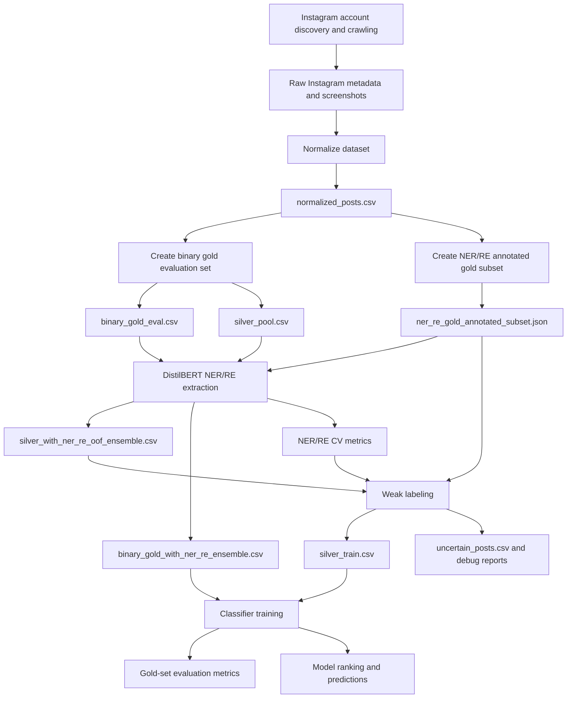

# Suspicious Educational Ads Detection

A reproducible NLP pipeline for detecting suspicious English-language Instagram educational advertisements about studying in Germany.

The project combines Instagram data collection, human-verified evaluation data, NER/Relation Extraction, weak supervision, and classifier evaluation. It is structured as a GitHub-ready research/code artifact so that collaborators or reviewers can understand the workflow, inspect the data contracts, and rerun the experiment from prepared inputs without crawling Instagram again.

---

## Table of Contents

- [Project Overview](#project-overview)
- [Main Contributions](#main-contributions)
- [Pipeline Overview](#pipeline-overview)
- [Repository Structure](#repository-structure)
- [Environment Setup](#environment-setup)
- [Recommended Workflow: Run from Prepared Data](#recommended-workflow-run-from-prepared-data)
- [Full Workflow: Rebuild from Instagram Data](#full-workflow-rebuild-from-instagram-data)
- [Step-by-Step Pipeline I/O](#step-by-step-pipeline-io)
- [How to Read the Input and Output Files](#how-to-read-the-input-and-output-files)
- [Important Output Files](#important-output-files)
- [Troubleshooting](#troubleshooting)
- [Data and Privacy Notes](#data-and-privacy-notes)
- [License](#license)

---

## Project Overview

This repository studies suspicious educational advertising on Instagram, focusing on English-language posts that promote studying in Germany. The system is designed around an ad-level binary classification task:

```text
normal vs suspicious
```

Instead of relying only on a final classifier, the pipeline builds structured intermediate evidence:

- normalized Instagram post data;
- a human-verified binary gold evaluation set;
- a manually annotated NER/Relation Extraction subset;
- DistilBERT-based NER/RE extraction outputs;
- weak labels created from deception-risk evidence;
- classifier baselines and feature-fusion models evaluated on the binary gold set.

The recommended way to use this repository is to run the prepared-data workflow. This skips crawling and manual annotation, then executes:

```text
NER/RE extraction → weak labeling → classifier training/evaluation
```

---

## Main Contributions

- A structured data pipeline for Instagram educational advertisement analysis.
- A binary gold evaluation set for held-out model evaluation.
- A manually annotated NER/Relation Extraction subset for structured signal extraction.
- A weak-labeling framework based on critical risk and co-occurrence-based deception accumulation.
- A classifier evaluation pipeline comparing TF-IDF, DistilBERT embeddings, NER/RE features, and late-fusion MLP variants.
- Clear input/output contracts for each pipeline step.

---

## Pipeline Overview



The repository supports two execution modes:

1. **Prepared-data mode**: use the curated files already placed in `data/prepared/` and rerun the modeling pipeline.
2. **Full reconstruction mode**: crawl/gather Instagram data, normalize it, create gold/silver data, then run NER/RE, weak labeling, and classifier evaluation.

---

## Repository Structure

```text
Suspicious_Educational_Ads_Detection_GitHub_Ready_v3_4/
├── src/
│   ├── collection/          # Instagram session, account discovery, and post crawling
│   ├── preprocessing/       # Normalize raw Instagram records
│   ├── annotation/          # Build binary gold evaluation set and silver pool
│   ├── extraction/          # Train/predict DistilBERT NER + relation-signal extractor
│   ├── weak_labeling/       # Weak-label construction from structured evidence
│   ├── modeling/            # Classifier baselines, ablations, and evaluation
│   └── utils/               # Shared utilities
├── data/
│   ├── prepared/            # Curated reproducible inputs
│   ├── raw/instagram/       # Raw crawl metadata and screenshots
│   └── processed/           # Normalized, split, NER/RE, and weak-label outputs
├── outputs/
│   └── classifier_evaluation/ # Final evaluation outputs
├── notebooks/               # Step-by-step notebooks mirroring the pipeline
├── docs/                    # Schema, pipeline I/O, setup, and migration notes
├── scripts/                 # Environment setup and pipeline runners
├── models/                  # Optional trained model checkpoints
├── reports/                 # Optional figures and report artifacts
├── secrets/                 # Local Instagram session files; ignored by Git
├── requirements.txt
├── pyproject.toml
└── README.md
```

---

## Environment Setup

Run all commands from the repository root.

### 1. Create a virtual environment

Windows PowerShell:

```powershell
python -m venv .venv
```

The commands below use the virtual-environment Python directly, so activating the environment is optional:

```powershell
.\.venv\Scripts\python.exe ...
```

### 2. Install dependencies

`requirements.txt` intentionally does **not** install PyTorch because CPU and GPU PyTorch builds use different package indexes.

CPU setup:

```powershell
.\.venv\Scripts\python.exe scripts\setup_environment.py --device cpu
```

GPU setup, recommended for full NER/RE training:

```powershell
.\.venv\Scripts\python.exe scripts\setup_environment.py --device gpu --cuda cu128 --allow-nightly-fallback
```

Check whether PyTorch can see the GPU:

```powershell
.\.venv\Scripts\python.exe scripts\check_torch_device.py
```

Expected GPU output includes:

```text
cuda available: True
NVIDIA GeForce RTX ...
```

For crawling workflows, also install the Playwright browser runtime:

```powershell
.\.venv\Scripts\python.exe -m playwright install chromium
```

---

## Recommended Workflow: Run from Prepared Data

Use this workflow when the prepared input files already exist in `data/prepared/`.

```text
data/prepared/
├── normalized_posts.csv
├── silver_pool.csv
├── binary_gold_eval.csv
├── ner_re_gold_annotated_subset.json
└── PREPARED_DATA_MANIFEST.json
```

Current prepared data summary:

| File | Rows | Role |
|---|---:|---|
| `data/prepared/normalized_posts.csv` | 1002 | Full normalized corpus for audit/reference |
| `data/prepared/silver_pool.csv` | 802 | Candidate pool used for NER/RE prediction and weak labeling |
| `data/prepared/binary_gold_eval.csv` | 173 | Human-verified binary evaluation set |
| `data/prepared/ner_re_gold_annotated_subset.json` | 255 records | NER/RE annotated subset for extractor training |

### Smoke test

Use a smoke test only to verify that dependencies, paths, and files work. Do not report smoke-test metrics as final results.

CPU-safe smoke test:

```powershell
.\.venv\Scripts\python.exe scripts\run_prepared_data_pipeline.py --device cpu --quick-test
```

GPU smoke test:

```powershell
.\.venv\Scripts\python.exe scripts\run_prepared_data_pipeline.py --device gpu --quick-test
```

### Full prepared-data run

Recommended GPU run:

```powershell
.\.venv\Scripts\python.exe scripts\run_prepared_data_pipeline.py --device gpu --fp16
```

If `--fp16` is unstable on the machine, run without it:

```powershell
.\.venv\Scripts\python.exe scripts\run_prepared_data_pipeline.py --device gpu
```

CPU run:

```powershell
.\.venv\Scripts\python.exe scripts\run_prepared_data_pipeline.py --device cpu
```

The prepared-data runner executes these scripts in order:

```text
src/extraction/train_ner_re_extractor.py
src/weak_labeling/build_weak_labels.py
src/modeling/train_classifier.py
```

You can preview the commands without running them:

```powershell
.\.venv\Scripts\python.exe scripts\run_prepared_data_pipeline.py --dry-run
```

You can also reuse intermediate outputs:

```powershell
# Reuse existing NER/RE outputs and rerun weak labeling + classifier
.\.venv\Scripts\python.exe scripts\run_prepared_data_pipeline.py --device gpu --skip-nerre

# Reuse existing NER/RE and weak-labeling outputs; rerun only classifier evaluation
.\.venv\Scripts\python.exe scripts\run_prepared_data_pipeline.py --device gpu --skip-nerre --skip-weak-labeling
```

---

## Full Workflow: Rebuild from Instagram Data

Use this workflow only if you want to reconstruct the dataset from raw Instagram collection. For most reviewers, the prepared-data workflow above is preferred.

### Step 1 — Save Instagram session

Script:

```text
src/collection/save_instagram_session.py
```

Command:

```powershell
.\.venv\Scripts\python.exe src\collection\save_instagram_session.py --output secrets\instagram_session.json
```

Input:

```text
Manual Instagram login in a Playwright browser window
```

Output:

```text
secrets/instagram_session.json
```

How to read the output:

- This file stores browser session state/cookies.
- It is required by the crawlers.
- It should never be committed to a public GitHub repository.

### Step 2 — Discover suspicious candidate accounts

Script:

```text
src/collection/discover_suspicious_accounts.py
```

Command:

```powershell
.\.venv\Scripts\python.exe src\collection\discover_suspicious_accounts.py
```

Input:

```text
Search queries defined inside the script
```

Outputs:

```text
data/raw/instagram/metadata/account_registry.json
data/raw/instagram/metadata/suspicious_account_discovery_log.jsonl
```

How to read the outputs:

- `account_registry.json` stores discovered Instagram accounts and crawler status fields such as `handle`, `group`, `posts_crawled`, and `status`.
- `suspicious_account_discovery_log.jsonl` stores line-by-line discovery/audit events. Each line is one JSON record.

### Step 3 — Crawl suspicious candidate posts

Script:

```text
src/collection/crawl_suspicious_posts.py
```

Command:

```powershell
.\.venv\Scripts\python.exe src\collection\crawl_suspicious_posts.py
```

Inputs:

```text
data/raw/instagram/metadata/account_registry.json
secrets/instagram_session.json
```

Outputs:

```text
data/raw/instagram/metadata/suspicious_candidate_posts.json
data/raw/instagram/metadata/crawl_state_suspicious_posts.json
data/raw/instagram/metadata/crawl_audit_suspicious_posts.jsonl
data/raw/instagram/screenshots/
```

How to read the outputs:

- `suspicious_candidate_posts.json` contains raw candidate posts with `seed_label=none`.
- `crawl_state_suspicious_posts.json` tracks crawler progress.
- `crawl_audit_suspicious_posts.jsonl` stores crawler decisions and skipped/accepted post events.
- `data/raw/instagram/screenshots/` stores post screenshots for audit or later multimodal analysis.

### Step 4 — Crawl legitimate seed posts

Script:

```text
src/collection/crawl_legitimate_posts.py
```

Command:

```powershell
.\.venv\Scripts\python.exe src\collection\crawl_legitimate_posts.py
```

Inputs:

```text
Trusted account list defined in src/collection/crawl_legitimate_posts.py
secrets/instagram_session.json
```

Outputs:

```text
data/raw/instagram/metadata/legitimate_seed_posts.json
data/raw/instagram/screenshots/
```

How to read the outputs:

- `legitimate_seed_posts.json` contains posts from official/public/private education-related sources.
- These rows are stored with `seed_label=legitimate` before downstream binary conversion.
- The file is used as normal/legitimate seed evidence, not as suspicious evidence.

### Step 5 — Normalize raw Instagram metadata

Script:

```text
src/preprocessing/build_normalized_dataset.py
```

Command:

```powershell
.\.venv\Scripts\python.exe src\preprocessing\build_normalized_dataset.py `
  --input-dir data\raw\instagram\metadata `
  --output data\processed\normalized\normalized_posts.csv
```

Input:

```text
data/raw/instagram/metadata/*.json
```

Output:

```text
data/processed/normalized/normalized_posts.csv
```

How to read the output:

- Each row is one Instagram post.
- `seed_label` is still only `none` or `legitimate` at this step.
- `clean_text` is the core caption used for NER/RE and weak-labeling evidence.
- `model_text` is a model-facing text version with normalized hashtags and abstracted markers.

Canonical columns:

```text
post_id, post_url, platform, account_name, source_file,
caption_text, clean_text, model_text,
hashtags, mentions, url_count, emoji_count, external_link,
screenshot_url, posting_time, language, seed_label
```

### Step 6 — Create binary gold evaluation set and silver pool

Script:

```text
src/annotation/build_binary_gold_split.py
```

Command:

```powershell
.\.venv\Scripts\python.exe src\annotation\build_binary_gold_split.py `
  --normalize data\processed\normalized\normalized_posts.csv `
  --annotation-subset data\processed\annotations\ner_re_gold_annotated_subset.json `
  --out-dir data\processed\splits
```

Inputs:

```text
data/processed/normalized/normalized_posts.csv
data/processed/annotations/ner_re_gold_annotated_subset.json
```

Outputs:

```text
data/processed/splits/binary_gold_candidates.csv
data/processed/splits/binary_gold_eval.csv
data/processed/splits/silver_pool.csv
data/processed/splits/binary_gold_selection_audit.csv
data/processed/splits/binary_gold_review_progress.json
```

How to read the outputs:

- `binary_gold_candidates.csv` contains candidate posts for manual binary annotation.
- `binary_gold_eval.csv` is the held-out human-verified evaluation set. Its `seed_label` values are `normal` or `suspicious`.
- `silver_pool.csv` is the remaining non-gold pool used for NER/RE prediction and weak-labeling.
- `binary_gold_selection_audit.csv` records selection metadata for transparency.
- `binary_gold_review_progress.json` lets the terminal review process resume if interrupted.

Manual terminal labels:

```text
1 / n  -> normal
2 / s  -> suspicious
3 / k  -> skip
4 / b  -> back / undo
q      -> save progress and quit
```

### Step 7 — Create NER/RE annotated gold subset

This is a manual annotation step. The repository expects a Label Studio-style JSON export.

Expected file:

```text
data/processed/annotations/ner_re_gold_annotated_subset.json
```

Prepared-data equivalent:

```text
data/prepared/ner_re_gold_annotated_subset.json
```

How to read the file:

- It is a JSON list of annotated examples.
- Each record contains post metadata under `data`.
- NER spans and relation-signal choices are stored under `annotations`.
- The extractor reads `data.post_id`, `data.text`, span labels, and relation-signal labels.

NER labels used by the extractor:

```text
COST_CLAIM, COST_DETAIL, REQUIREMENT, NEGATION_CUE,
PROGRAM_OR_INTAKE, FIELD_OF_STUDY, GENERIC_INSTITUTION,
SPECIFIC_EDU_ORG, SERVICE_PROVIDER, SUPPORT_SERVICE,
OUTCOME, GUARANTEE_CUE, VAGUE_BENEFIT, PRESSURE_CUE,
TESTIMONIAL_ACTOR, DESTINATION
```

Relation-signal labels:

```text
OUTCOME_GUARANTEED
REQUIREMENT_WAIVED
TESTIMONIAL_SUCCESS_CLAIM
PROGRAM_OR_OUTCOME_HAS_VERIFIABLE_ORG
```

### Step 8 — Run NER/RE extraction for silver and binary gold

Script:

```text
src/extraction/train_ner_re_extractor.py
```

Command:

```powershell
.\.venv\Scripts\python.exe src\extraction\train_ner_re_extractor.py `
  --nerre-json data\prepared\ner_re_gold_annotated_subset.json `
  --silver-csv data\prepared\silver_pool.csv `
  --binary-gold-csv data\prepared\binary_gold_eval.csv `
  --out-dir data\processed\ner_re `
  --model-name distilbert-base-uncased `
  --silver-text-col clean_text `
  --binary-text-col clean_text `
  --num-folds 5 `
  --epochs-ner 5 `
  --epochs-re 5 `
  --batch-size 4 `
  --pred-batch-size 8 `
  --max-length 384
```

Add `--cpu` for CPU execution:

```powershell
.\.venv\Scripts\python.exe src\extraction\train_ner_re_extractor.py ... --cpu
```

Add `--fp16` for GPU mixed precision:

```powershell
.\.venv\Scripts\python.exe src\extraction\train_ner_re_extractor.py ... --fp16
```

Inputs:

```text
data/prepared/ner_re_gold_annotated_subset.json
data/prepared/silver_pool.csv
data/prepared/binary_gold_eval.csv
```

Outputs:

```text
data/processed/ner_re/cv_results/fold_summary_metrics.csv
data/processed/ner_re/cv_results/cv_average_metrics.json
data/processed/ner_re/cv_results/ner_per_label_average.csv
data/processed/ner_re/cv_results/re_per_label_average.csv
data/processed/ner_re/predictions/silver_with_ner_re_oof_ensemble.csv
data/processed/ner_re/predictions/binary_gold_with_ner_re_ensemble.csv
data/processed/ner_re/final_extraction_summary.json
```

How to read the outputs:

- `ner_per_label_average.csv` reports average NER performance per entity label.
- `re_per_label_average.csv` reports average relation-signal performance per label.
- `silver_with_ner_re_oof_ensemble.csv` is the silver pool enriched with NER/RE features.
- `binary_gold_with_ner_re_ensemble.csv` is the binary gold set enriched with the same NER/RE feature schema.
- `final_extraction_summary.json` summarizes the run configuration and key output paths.

### Step 9 — Build weak labels for classifier training

Script:

```text
src/weak_labeling/build_weak_labels.py
```

Command:

```powershell
.\.venv\Scripts\python.exe src\weak_labeling\build_weak_labels.py `
  --silver-csv data\processed\ner_re\predictions\silver_with_ner_re_oof_ensemble.csv `
  --gold-json data\prepared\ner_re_gold_annotated_subset.json `
  --ner-metrics data\processed\ner_re\cv_results\ner_per_label_average.csv `
  --re-metrics data\processed\ner_re\cv_results\re_per_label_average.csv `
  --out-dir data\processed\weak_labeling
```

Inputs:

```text
data/processed/ner_re/predictions/silver_with_ner_re_oof_ensemble.csv
data/prepared/ner_re_gold_annotated_subset.json
data/processed/ner_re/cv_results/ner_per_label_average.csv
data/processed/ner_re/cv_results/re_per_label_average.csv
```

Outputs:

```text
data/processed/weak_labeling/silver_train.csv
data/processed/weak_labeling/uncertain_posts.csv
data/processed/weak_labeling/weak_labeling_report.csv
data/processed/weak_labeling/weak_labeling_scored_posts_debug.csv
```

How to read the outputs:

- `silver_train.csv` is the modeling-ready silver training set. Its `seed_label` values are `normal` or `suspicious`.
- `uncertain_posts.csv` contains posts marked uncertain by the weak-labeling framework and removed from classifier training.
- `weak_labeling_report.csv` contains summary counts, schema audit information, and rule/evidence diagnostics.
- `weak_labeling_scored_posts_debug.csv` contains full row-level evidence scores and should be used for auditing, not as direct classifier input.

Weak-labeling thresholds:

```text
score < 0.40      -> normal
0.40 to 0.69      -> uncertain
score >= 0.70     -> suspicious
```

### Step 10 — Train classifiers and evaluate on binary gold

Script:

```text
src/modeling/train_classifier.py
```

Command:

```powershell
.\.venv\Scripts\python.exe src\modeling\train_classifier.py `
  --train data\processed\weak_labeling\silver_train.csv `
  --gold data\processed\ner_re\predictions\binary_gold_with_ner_re_ensemble.csv `
  --output_dir outputs\classifier_evaluation `
  --bert_model distilbert-base-uncased `
  --max_length 256 `
  --bert_batch_size 16 `
  --mlp_batch_size 32 `
  --hidden_dim 256 `
  --dropout 0.35 `
  --lr 0.0005 `
  --weight_decay 0.0001 `
  --epochs 40 `
  --patience 8 `
  --split_mode stratified `
  --threshold_mode val_f1 `
  --imbalance_mode pos_weight `
  --seeds 1,7,13,21,42 `
  --device gpu
```

Inputs:

```text
data/processed/weak_labeling/silver_train.csv
data/processed/ner_re/predictions/binary_gold_with_ner_re_ensemble.csv
```

Outputs:

```text
outputs/classifier_evaluation/classifier_schema_audit.json
outputs/classifier_evaluation/metrics_by_run.csv
outputs/classifier_evaluation/metrics_summary.csv
outputs/classifier_evaluation/gold_model_ranking.csv
outputs/classifier_evaluation/gold_predictions_all_models.csv
outputs/classifier_evaluation/error_analysis_by_content_group.csv
outputs/classifier_evaluation/classifier_results.json
```

How to read the outputs:

- `metrics_by_run.csv` contains model metrics for every seed and evaluation phase.
- `metrics_summary.csv` aggregates mean/std metrics across seeds.
- `gold_model_ranking.csv` sorts models by gold-set suspicious-class F1, macro-F1, and PR-AUC.
- `gold_predictions_all_models.csv` stores row-level predictions on the binary gold set.
- `error_analysis_by_content_group.csv` summarizes errors by content group.
- `classifier_schema_audit.json` explains which text, label, NER/RE, and weak-feature columns were used or excluded.
- `classifier_results.json` stores the full detailed results object.

---

## Step-by-Step Pipeline I/O

| Step | Script | Main input | Main output | Purpose |
|---|---|---|---|---|
| Save session | `src/collection/save_instagram_session.py` | Manual Instagram login | `secrets/instagram_session.json` | Store local browser session for crawling |
| Discover accounts | `src/collection/discover_suspicious_accounts.py` | Search queries in script | `account_registry.json` | Find suspicious candidate accounts |
| Crawl suspicious posts | `src/collection/crawl_suspicious_posts.py` | `account_registry.json`, session | `suspicious_candidate_posts.json` | Collect candidate posts with `seed_label=none` |
| Crawl legitimate posts | `src/collection/crawl_legitimate_posts.py` | Trusted account config, session | `legitimate_seed_posts.json` | Collect legitimate seed posts |
| Normalize | `src/preprocessing/build_normalized_dataset.py` | Raw JSON metadata | `normalized_posts.csv` | Clean, deduplicate, and standardize schema |
| Binary split | `src/annotation/build_binary_gold_split.py` | Normalized CSV, NER/RE subset keys | `binary_gold_eval.csv`, `silver_pool.csv` | Create held-out binary gold and silver pool |
| NER/RE extraction | `src/extraction/train_ner_re_extractor.py` | NER/RE JSON, silver, binary gold | NER/RE metrics and enriched CSVs | Train/predict structured features |
| Weak labeling | `src/weak_labeling/build_weak_labels.py` | Enriched silver, NER/RE metrics, NER/RE JSON | `silver_train.csv` | Create classifier training labels |
| Classifier evaluation | `src/modeling/train_classifier.py` | `silver_train.csv`, enriched binary gold | `outputs/classifier_evaluation/*` | Train baselines/fusion models and evaluate |

---

## How to Read the Input and Output Files

### Read CSV files with pandas

```python
import pandas as pd

# Normalized corpus
normalized = pd.read_csv("data/prepared/normalized_posts.csv")
print(normalized.shape)
print(normalized.columns.tolist())
print(normalized["seed_label"].value_counts())

# Inspect the most important columns
print(normalized[["post_id", "account_name", "clean_text", "model_text", "seed_label"]].head())
```

### Read the binary gold evaluation set

```python
import pandas as pd

gold = pd.read_csv("data/prepared/binary_gold_eval.csv")
print(gold.shape)
print(gold["seed_label"].value_counts())
print(gold[["post_id", "account_name", "clean_text", "seed_label"]].head())
```

Interpretation:

- `seed_label=normal`: human-verified normal post.
- `seed_label=suspicious`: human-verified suspicious post.
- This file is used only for evaluation, not for classifier training.

### Read the silver pool

```python
import pandas as pd

silver = pd.read_csv("data/prepared/silver_pool.csv")
print(silver.shape)
print(silver["seed_label"].value_counts())
```

Interpretation:

- `seed_label=none`: unlabeled/candidate post before weak labeling.
- `seed_label=legitimate`: legitimate seed post before weak-label conversion.
- The weak-labeling step converts the final training rows into `normal` or `suspicious`.

### Read NER/RE annotation JSON

```python
import json

with open("data/prepared/ner_re_gold_annotated_subset.json", "r", encoding="utf-8") as f:
    records = json.load(f)

print(len(records))
print(records[0]["data"].keys())
print(records[0]["data"].get("post_id"))
print(records[0]["data"].get("text"))
print(records[0].get("annotations", [])[:1])
```

Interpretation:

- `data.text` is the caption text used for annotation.
- `data.post_id` links the annotation back to CSV rows.
- `annotations` contains entity spans and relation-signal choices.

### Read NER/RE predictions

```python
import pandas as pd

silver_nerre = pd.read_csv("data/processed/ner_re/predictions/silver_with_ner_re_oof_ensemble.csv")
gold_nerre = pd.read_csv("data/processed/ner_re/predictions/binary_gold_with_ner_re_ensemble.csv")

print(silver_nerre.shape)
print(gold_nerre.shape)
print([c for c in silver_nerre.columns if c.startswith("ner_")][:10])
print([c for c in silver_nerre.columns if c.startswith("re_")][:10])
```

Interpretation:

- NER columns store detected entity information or label-level features.
- RE columns store relation-signal predictions.
- The silver and binary-gold enriched files should share the same NER/RE feature schema.

### Read weak-labeling outputs

```python
import pandas as pd

train = pd.read_csv("data/processed/weak_labeling/silver_train.csv")
uncertain = pd.read_csv("data/processed/weak_labeling/uncertain_posts.csv")
report = pd.read_csv("data/processed/weak_labeling/weak_labeling_report.csv")

print(train["seed_label"].value_counts())
print(uncertain.shape)
print(report.head())
```

Interpretation:

- `silver_train.csv` is the final classifier training file.
- `uncertain_posts.csv` is excluded from training but useful for manual review.
- `weak_labeling_report.csv` explains label counts and schema decisions.

### Read classifier evaluation outputs

```python
import pandas as pd

ranking = pd.read_csv("outputs/classifier_evaluation/gold_model_ranking.csv")
summary = pd.read_csv("outputs/classifier_evaluation/metrics_summary.csv")
predictions = pd.read_csv("outputs/classifier_evaluation/gold_predictions_all_models.csv")

print(ranking[[
    "model",
    "n_runs",
    "f1_suspicious_mean",
    "recall_suspicious_mean",
    "precision_suspicious_mean",
    "macro_f1_mean"
]].head(10))

print(summary.head())
print(predictions.head())
```

Interpretation:

- Use `gold_model_ranking.csv` to identify the best model on the held-out binary gold set.
- Focus on `f1_suspicious_mean`, `precision_suspicious_mean`, `recall_suspicious_mean`, `macro_f1_mean`, and `balanced_accuracy_mean`.
- Use `gold_predictions_all_models.csv` for manual error analysis.

---

## Important Output Files

After a successful prepared-data run, the main outputs are:

```text
data/processed/ner_re/
├── cv_results/
│   ├── ner_per_label_average.csv
│   ├── re_per_label_average.csv
│   ├── fold_summary_metrics.csv
│   └── cv_average_metrics.json
└── predictions/
    ├── silver_with_ner_re_oof_ensemble.csv
    └── binary_gold_with_ner_re_ensemble.csv

data/processed/weak_labeling/
├── silver_train.csv
├── uncertain_posts.csv
├── weak_labeling_report.csv
└── weak_labeling_scored_posts_debug.csv

outputs/classifier_evaluation/
├── classifier_schema_audit.json
├── metrics_by_run.csv
├── metrics_summary.csv
├── gold_model_ranking.csv
├── gold_predictions_all_models.csv
├── error_analysis_by_content_group.csv
└── classifier_results.json
```

For writing the result section, start with:

```text
outputs/classifier_evaluation/gold_model_ranking.csv
outputs/classifier_evaluation/metrics_summary.csv
outputs/classifier_evaluation/classifier_results.json
outputs/classifier_evaluation/error_analysis_by_content_group.csv
```

---

## Troubleshooting

### GPU is not detected

Check PyTorch:

```powershell
.\.venv\Scripts\python.exe scripts\check_torch_device.py
```

If it prints `cuda available: False`, reinstall GPU PyTorch:

```powershell
.\.venv\Scripts\python.exe scripts\setup_environment.py --device gpu --cuda cu128 --allow-nightly-fallback
```

### Hugging Face Trainer says `accelerate` is missing

```powershell
.\.venv\Scripts\python.exe -m pip install "accelerate>=1.1.0"
```

### Cached DistilBERT embeddings have the wrong shape

If `silver_train.csv` changes, old cached embeddings may no longer match the current rows.

```powershell
Remove-Item outputs\classifier_evaluation\cache_embeddings_*.npy -ErrorAction SilentlyContinue
.\.venv\Scripts\python.exe scripts\run_prepared_data_pipeline.py --device gpu --skip-nerre --skip-weak-labeling
```

### PowerShell blocks virtual-environment activation

You do not need to activate the environment. Use the direct Python path:

```powershell
.\.venv\Scripts\python.exe ...
```

Or allow activation only for the current PowerShell session:

```powershell
Set-ExecutionPolicy -Scope Process -ExecutionPolicy Bypass
.\.venv\Scripts\Activate.ps1
```

---

## Data and Privacy Notes

This project may contain public Instagram captions, URLs, account names, screenshots, and names appearing in testimonial captions.

Recommended GitHub practice:

- Do not commit `secrets/instagram_session.json`.
- Do not commit raw crawler state unless needed for a private/reviewer artifact.
- Avoid publishing raw screenshots in a public repository unless your data-release plan permits it.
- For a public GitHub repository, consider keeping only a small sample dataset and storing the full prepared data in a controlled/private location.
- For a private reviewer repository, `data/prepared/` is useful because it allows the experiment to be rerun without re-crawling Instagram.

---

## License

This project is intended as a research software artifact. Add a license file such as `MIT`, `Apache-2.0`, or a custom research-use license depending on the intended release policy.
